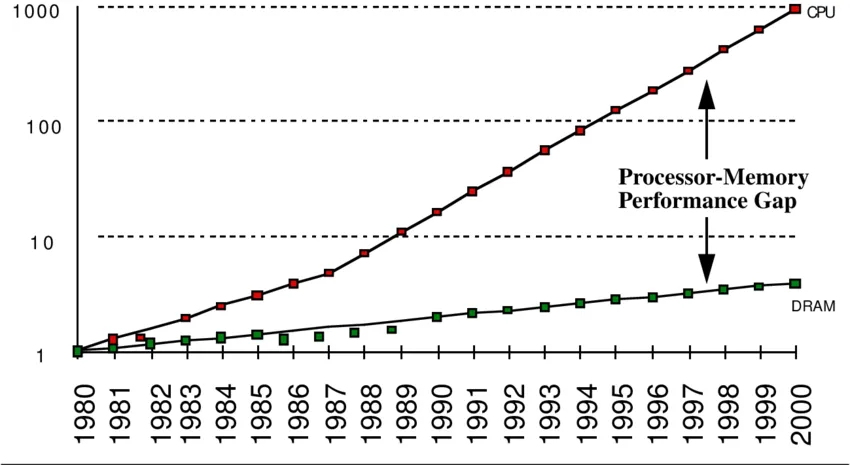

Created by : seophohoho  
Created datetime : 2024-03-31 14:03  
Tags : #about_computer  
## What is cache memory??
- processor 내부에 있는 메모리(L1,L2,L3 cache memory)
- main memory보다 속도가 빠르고, 가격이 비쌈.
- **main memory의 입출력 병목현상(I/O bottleneck) 해소를 하기 위해서 등장.**

## Cache operation progress
1. **데이터 접근 요청**: CPU는 연산을 수행하기 위해 특정 데이터나 명령어에 접근.
2. **L1 캐시(Level 1 Cache) 검색**: CPU는 먼저 가장 빠른 캐시인 L1에서 해당 데이터를 찾음.
    - **Cache Hit (L1)**: 데이터가 L1 캐시에 있으면 바로 CPU에 전달.
    - **Cache Miss (L1)**: 데이터가 L1 캐시에 없으면 L2 캐시에서 검색.
3. **L2 캐시 검색**: L2 캐시에서 데이터 검색.
    - **Cache Hit (L2)**: 데이터가 L2 캐시에 있으면 L1 캐시로 옮겨진 후 CPU에 전달. L2 캐시는 L1보다 느리지만 L3보다는 빠름.
    - **Cache Miss (L2)**: 데이터가 L2 캐시에도 없으면 L3 캐시에서 검색.
4. **L3 캐시 검색**: 최종적으로 L3 캐시에서 데이터 검색.
    - **Cache Hit (L3)**: 데이터가 L3 캐시에 있으면, L2, L1 캐시로 순차적으로 옮겨지며 최종적으로 CPU에 전달. L3는 L1, L2에 비해 느리지만, 메인 메모리보다는 훨씬 빠릅니다.
    - **Cache Miss (L3)**: 모든 캐시 레벨에서 데이터를 찾지 못하면, 마지막으로 메인 메모리에서 데이터를 검색. 이 경우 접근 시간이 가장 길어지며, 시스템의 성능에 영향을 줄 수 있음.
## Cache hit and Cache miss
- **Cache Hit**: CPU가 요청한 데이터나 명령어가 캐시 메모리에 존재하여 바로 접근할 수 있는 상태. Cache hit 비율이 높을수록 시스템 성능이 좋아짐.
- **Cache Miss**: CPU가 요청한 데이터나 명령어가 캐시 메모리에 없어서 다른 메모리 계층으로 접근해야 하는 상태. 캐시 미스가 발생하면 데이터를 가져오는 데 더 많은 시간이 소요되며, 이는 시스템 성능 저하로 이어질 수 있음.
## locality
- Spatial locality(공간적 지역성)
	- 참조한 주소와 인접한 주소를 참조하는 특성
- Temporal locality(시간적 지역성)
	- 한번 참조한 주소를 곧 다시 참조하는 특성(for문 등의 순환문)

**즉, 지역성은 cache hit ratio와 밀접하다.**  
**알고리즘 성능 향상 위한 중요한 요소 중 하나**

