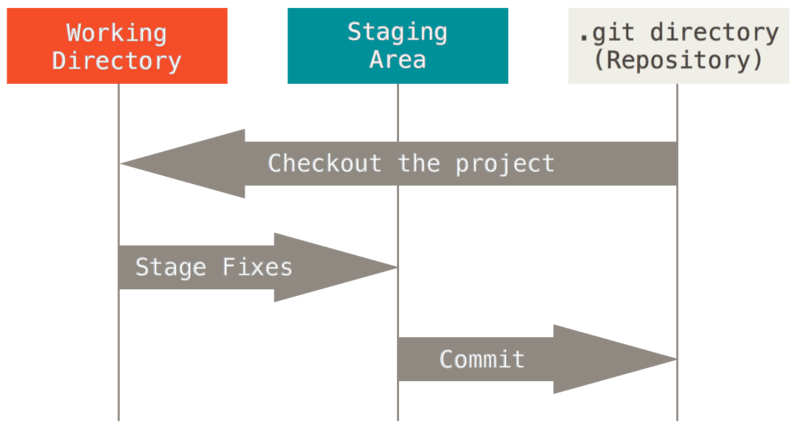

Created by : seophohoho  
Created datetime : 2023-12-22 09:16  
Tags :  #Git 
## 3가지 상태
Git은 파일을 `Commited`,`Modified`,`Staged` 이렇게 3가지 상태로 관리한다.
- `Commited`: 데이터가 로컬 데이터베이스에 안전하게 저장된 상태.
- `Modified` : 수정한 파일을 아직 로컬 데이터베이스에 저장하지 않은 상태.
- `Staged` : 현재 수정한 파일을 곧 Commit할 것이라고 표시한 상태.
## Git 프로젝트의 3가지 단계

- `.git directory(Repository)` : 
	- Git이 프로젝트의 메타데이터와 객체 데이터베이스를 저장하는 곳을 말한다.
	- `git init` 혹은 `git clone` 명령어를 사용하게 될 시, 해당 디렉토리에 `.git` 이라는 숨김파일이다.
- `워킹 트리(Working Directory)` :
	- `.git directory` 안에 저장되어 있는 압축된 데이터베이스에서 파일을 가져와서 워킹 트리를 생성한다.
	- 프로젝트의 특정 version을 checkout한다.
- `Staging Area` :
	- Git 디렉토리에 있다. 
	- 단순한 파일이고 곧 커밋할 파일에 대한 정보를 저장한다. 
	- Git에서는 기술용어로는 “Index” 라고 하지만, “Staging Area” 라는 용어를 써도 상관 없다.

즉, Git의 작업 흐름은 다음과 같다.
1. **Modified (수정됨):** 파일을 수정(즉, 워킹 트리에서) 하면 해당 파일은 Modified 상태가 됨.
2. **Staged (스테이징):** 수정된 파일을 Staging Area에 추가하려면 `git add` 명령어를 사용.
3. Staging Area에 추가된 파일은 Staged 상태가 됨.
4. **Committed (커밋됨):** Staging Area에 있는 파일들을 커밋하면 해당 파일들은 `.git directory`에 저장되어 Committed 상태가 됨.

Git이 체크하는 파일은 크게 2가지 분류가 있음.
- Trancked: Git이 알고 있는 파일.
- Untrakced : Git이 모르는 파일.