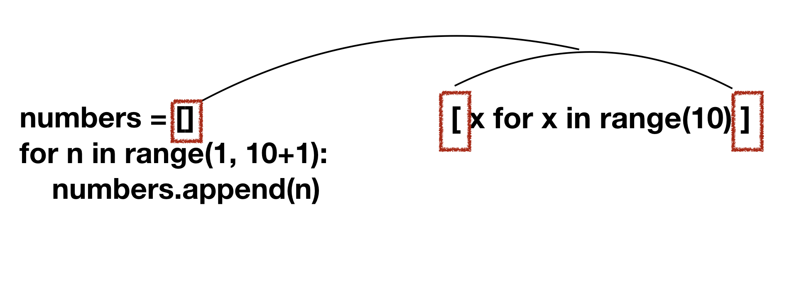
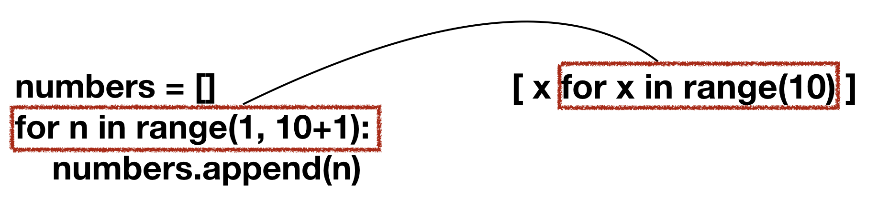
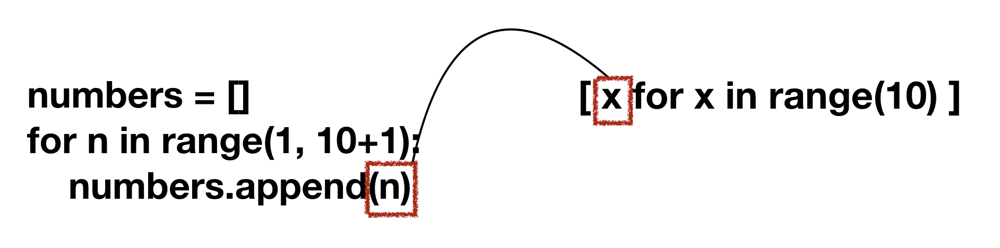

Created by : seophohoho  
Created datetime : 2024-03-28 13:41  
Tags : #about_computer #python
eng or kor : 
## INTRO
**‘리스트를 쉽게, 짧게 한 줄로 만들 수 있는 파이썬의 문법’**. 
- Before
```python
numbers = [] 
for n in range(1, 10+1): 
	numbers.append(n)
```
- After
```python
[x for x in range(10)]
```


