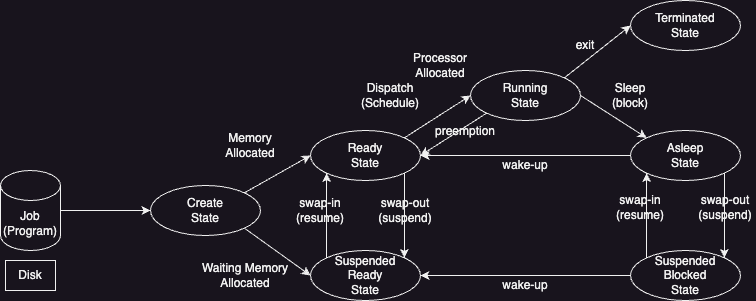

Created by : seophohoho  
Created datetime : 2024-03-30 16:30  
Tags : #about_computer   
## Process State Transition Diagram

### Create State
- 작업(Job)을 kernel에 등록
- [[PCB]] 할당 과 [[process]] 생성
- kernel은 가용 메모리 공간 체크를 통해서 Ready state or Suspended ready state로 전이
### Ready State
**Processor 외에 다른 모든 [[resource]]을 할당 받은 상태**  
- 즉시 실행 가능한 상태.  
- Processor 할당 대기 상태.  
Processor 할당이 완료된다면, Running state로 전이.  
### Running State
**Processor와 필요한 [[resource]]을 모두 할당 받은 상태**  
- Processor Scheduling을 통해서 Timer run-out이 발생하면, preemption이 발생하고, ready state로 전이
- 해당 process가 I/O등 자원 할당을 요청하면, asleep state로 전이
### Blocked/Asleep State
**프로세서 외에 다른 자원을 기다리는 상태**
- 요청한 I/O 자원 할당 요청이 완료 되면, ready state로 전이
### Terminated/Zombie State
**프로세스 수행이 끝난 상태**  
모든 자원이 반납되고, kernel 내에서는 일부 [[PCB]] 정보만 남아 있는 상태
### Suspended State
**메모리를 할당 받지 못한(빼앗기거나) 상태**
기존에 특정 process가 실행 중에, Suspended State로 전이가 되면, process의 정보(즉, Memory image)를 swap-device에 보관

