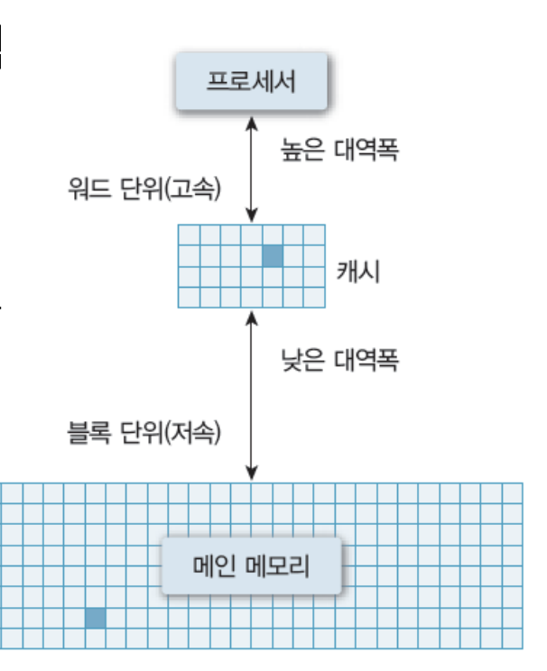
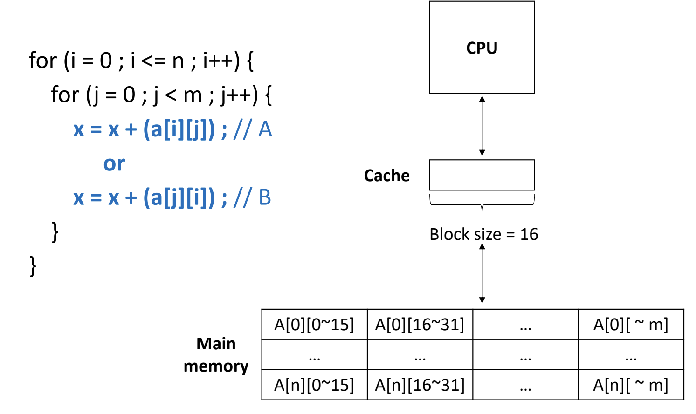

Created by : seophohoho  
Created datetime : 2023-12-22 17:45  
Tags :  #CS #Computer_Structure 
## 캐시(Cache)
• 프로세서 내부에 있는 메모리 (L1, L2 캐시 등)
	• 속도가 빠르고, 가격이 비쌈
• 메인 메모리의 입출력 병목현상 해소
## 캐시의 동작
• 일반적으로 HW적으로 관리 됨
• 캐시 히트 (Cache hit)
	• 필요한 데이터 블록이 캐시 존재
• 캐시 미스 (Cache miss)
	• 필요한 데이터 블록이 없는 경우

## 지역성(Locality)
• 공간적 지역성 (Spatial locality)
	• 참조한 주소와 인접한 주소를 참조하는 특성
		• 예) 순차적 프로그램 수행
• 시간적 지역성 (Temporal locality)
	• 한 번 참조한 주소를 곧 다시 참조하는 특성
		• 예) For 문 등의 순환 문
• 지역성은 캐시 적중률(cache hit ratio)과 밀접
	• 알고리즘 성능 향상 위한 중요한 요소 중 하나
	

캐시는 메모리에 있는 데이터를 블록 단위로 가져와서 저장하기 한다.  
A와 B 코드 중, 캐시 히트(cache hit) 빈번하게 일어나는 코드는 A이다.