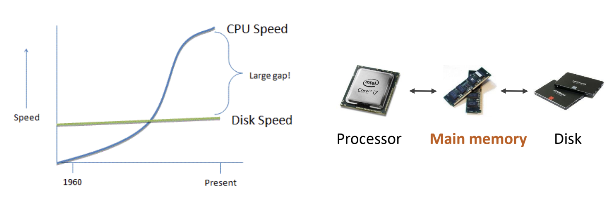

Created by : seophohoho  
Created datetime : 2023-12-22 17:41  
Tags :  #CS #Computer_Structure 
## 주기억장치(Main Memory)
- 프로세서가 수행할 프로그램과 데이터 저장
- DRAM을 주로 사용
	- 용량이 크고, 가격이 저렴.
- __디스크 입출력 병목현상(I/O bottleneck)__ 을 해결해 주었다.

