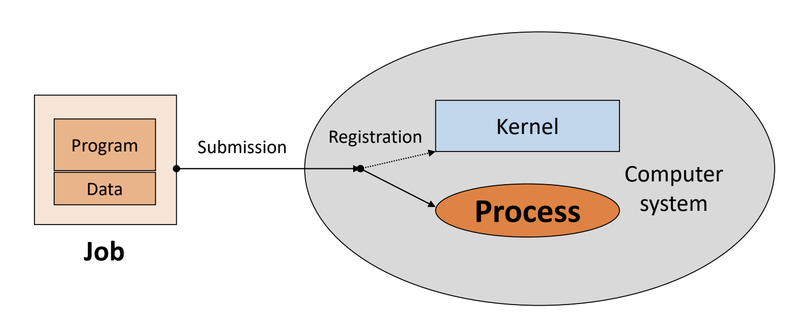
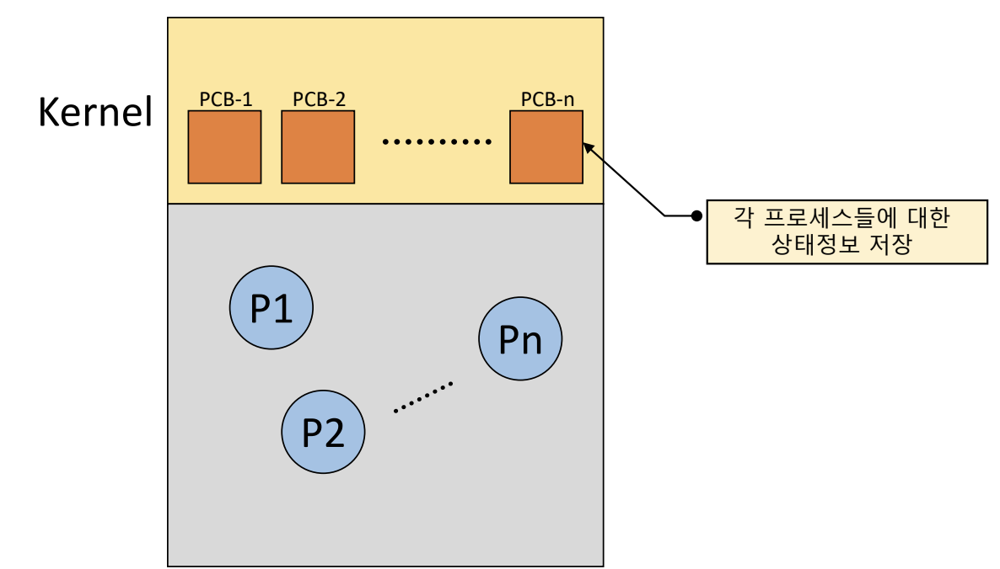
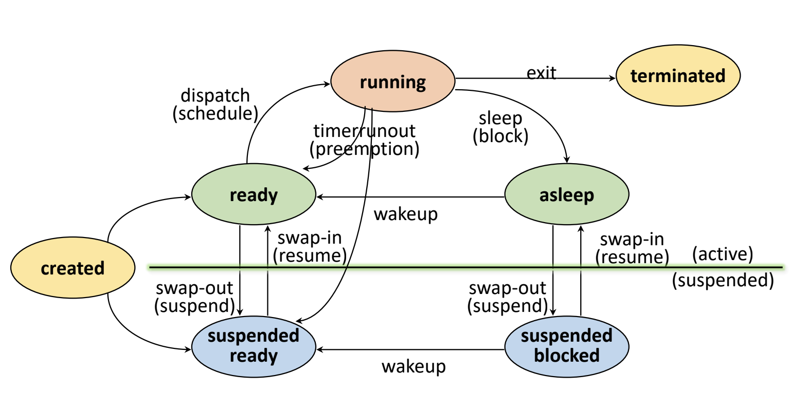
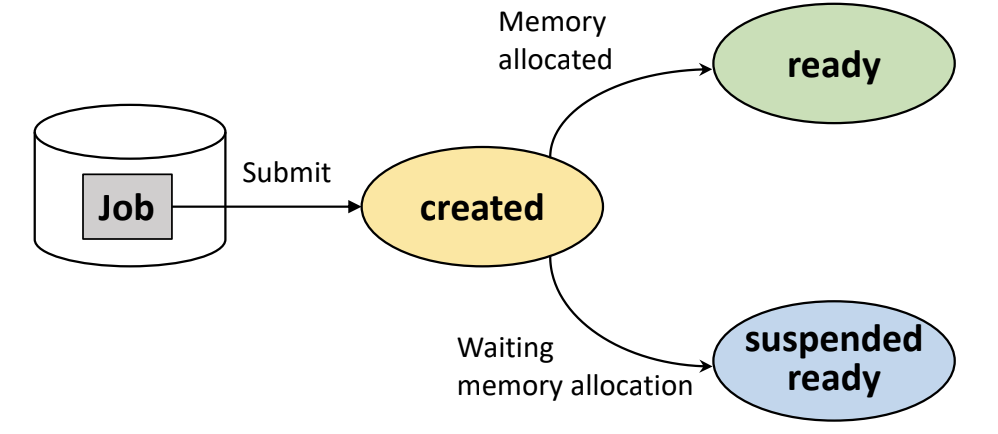
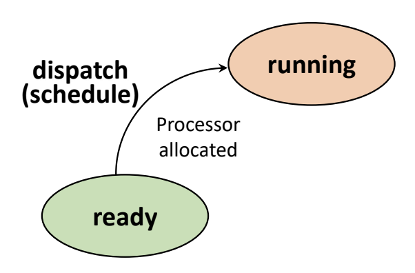
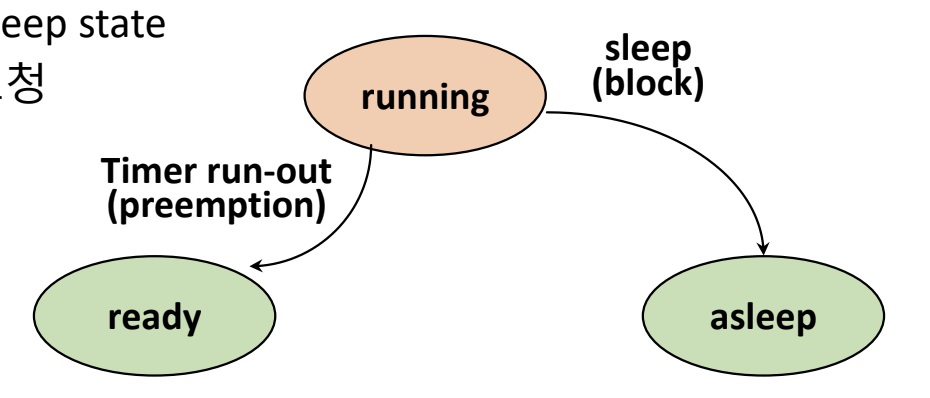
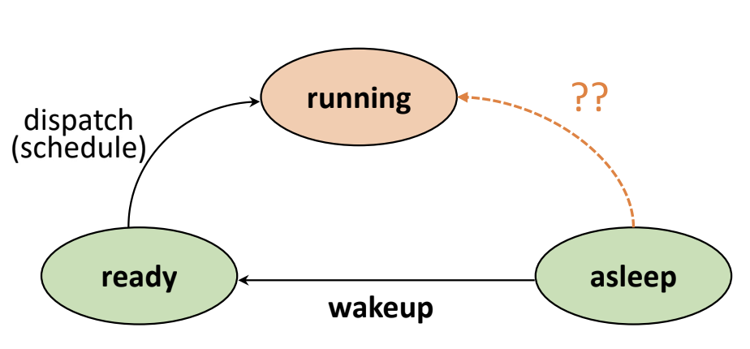
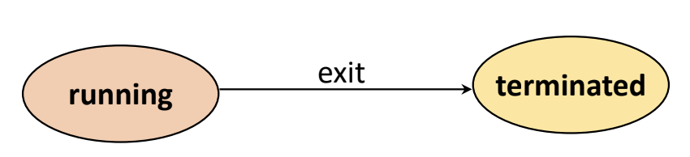
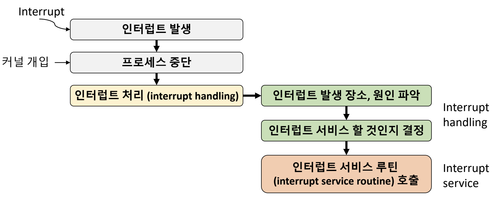
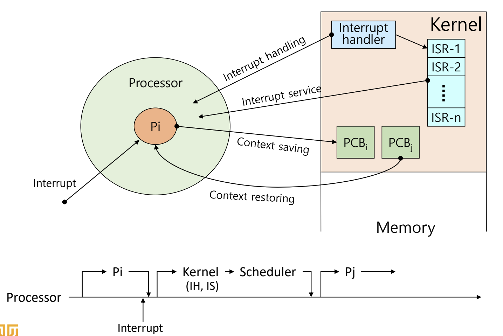

Created by : seophohoho  
Created datetime : 2024-01-04 15:27  
Tags :  #OS #CS 
## Job vs Process
- Job(작업) or Program(프로그램)
	- 실행 할 프로그램 + 데이터
	- 컴퓨터 시스템에 실행 요청 전의 상태
- Process
	- 실행을 위해서 커널(kernel)에 등록된 작업
	- 시스템 성능 향상을 위해서 커널(kernel)에 의해서 관리

## 프로세스의 정의
- 실행 중인 프로그램
- 커널(kernel)에 등록되고 커널의 관리 하에 있는 작업.
- 각종 자원들을 요청하고 할당 받을 수 있는 개체(entity).
- Process Control Block(PCB, 프로세스 관리 블록)을 할당 받은 개체.
- 능동적인 개체(Acive entity)
	- 실행 중에 각종 자원을 요구, 할당, 반납하며 실행한다는 의미.
## Resource(자원)
- 커널의 관리 하에 프로세스에게 할당/반납 되는 수동적인 개체(passive entity)
- H/W resources
	- Processor, memory, disk, monitor, keyboard, Etc.
- S/W resources
	- Message, signal, files, installed SWs, Etc.
## Process Control Block(PCB)
- OS가 프로세스 관리에 필요한 정보를 저장.
- 프로세스 생성 시, PCB가 생성.  

- PCB는 다음과 같은 정보들을 가짐.
	- PID(Process Identification Number)
		- 프로세스 고유 식별 번호
	- Scheduling 정보
		- 프로세스 우선순위와 같은 스케쥴링 관련 정보들
	- 프로세스 상태
		- 자원 할당, 요청 정보 등
	- 메모리 관리 정보
		- Page Table, Segment Table
	- 입출력 상태 정보
		- 할당 받은 입출력 장치, 파일 등에 대한 정보 등
	- 문맥 저장 영역(Context save area)
		- 프로세스 레지스터 상태를 저장하는 공간 등
	- 계정 정보
		- 자원 사용 시간 등을 관리
- PCB 정보는 OS 마다 다름.
- PCB 참조 및 Update 속도는 OS의 성능을 결정 짓는 중요한 요소 중의 하나.
## Process States
### Process State Transition Diagram

### Create State
- 작업(Job)을 커널(Kernel)에 등록.
	- 커널(Kernel)은 가용 메모리 공간 체크 및 프로세스 상태 전이.
		- 가용 메모리 공간이 있다면, ready 상태로 전이
		- 가용 메모리 공간이 없다면, suspended ready 상태로 전이
- PCB 할당 및 프로세스 생성. 

### Ready State
- 프로세서(CPU) 외에 다른 모든 자원을 할당 받은 상태
- 즉, 프로세서(CPU) 할당 대기 상태
- 프로세서(CPU) 할당이 완료 된다면, dispatch(or Schedule) 상태가 된다.
	- Ready State -> Running State. 

### Running State
- 프로세서(CPU)와 필요한 자원을 모두 할당 받은 상태. 즉, CPU가 해당 프로세스를 실행 중이다.
- 프로세스 스케쥴링에 의해서 (예를 들어서 time-out, priority changes) 프로세서(CPU)가 다른 프로세스로 작업을 변경할 경우, 실행하고 있던 프로세스는 ready 상태가 된다. 이를 Preemption이라고 함.
	- Running State -> Ready State
- 실행 중이던 프로세스가 I/O 자원 할당을 요청하면, sleep(block)이 된다.
	- Running State -> asleep State. 

### Blocked/Asleep State
- 프로세서 외에 다른 자원을 기다리는 상태
	- 여기서 자원 할당은 System call에 의해서 이루어짐.
- 요청한 자원 할당이 끝나면, Wake-up를 한다.
	- Asleep State -> Ready State. 

### Suspended State
- 메모리를 할당 받지 못한(빼앗긴) 상태
	- Memory image를 swap devide에 보관.
- Kernel or User에 의해서 발생.  

### Terminated/Zombie State
- 프로세스 수행이 끝난 상태.
- 모든 자원을 반납하고 난 상태.
- 커널 내에 일부 PCB 정보만 남아 있는 상태.
	- 프로세스 관리를 위한 정보 수집을 위해서. 

## Interrupt
- 예상치 못한, 외부에서 발생하는 event
### Interrupt 처리 과정

## Context Switching
### Context
- 프로세스와 관련된 정보들의 집합
	- CPU register context => in CPU
	- Code & data, Stack, PCB => in memory
### Context saving
- 현재 프로세스의 Register context를 저장하는 작업
### Context restoring
- Register context를 프로세스로 복구하는 작업
### Context switching ≅ Process switching
- 실행 중인 프로세스의 context를 저장하고, 앞으로 실행 할 프로세스의 context를 복구 하는 일
- 커널의 개입으로 이루어짐
### Context Switch Cost
- OS마다 다르며, OS의 성능에 큰 영향을 끼침.
- 그렇기 떄문에, 불필요한 Context Switching을 줄이는 것이 중요.
	- Thread를 사용하는 것이 해결 방법.