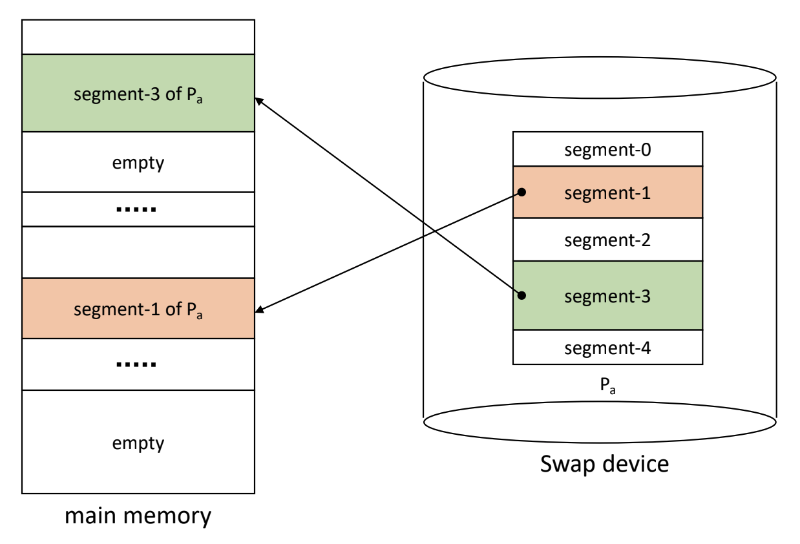
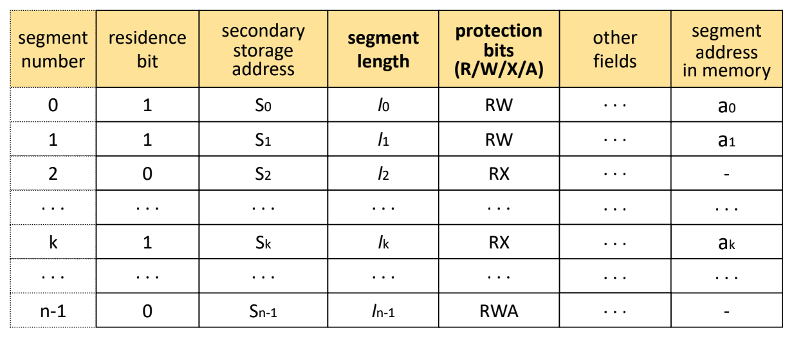
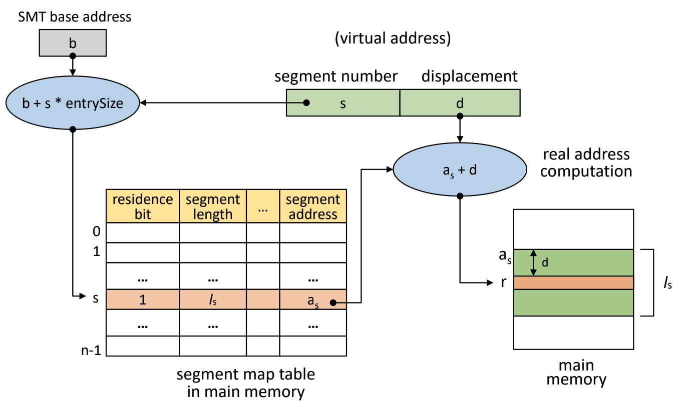
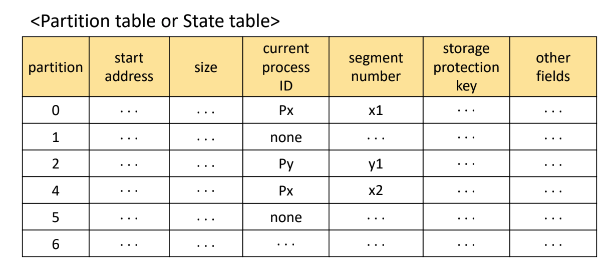
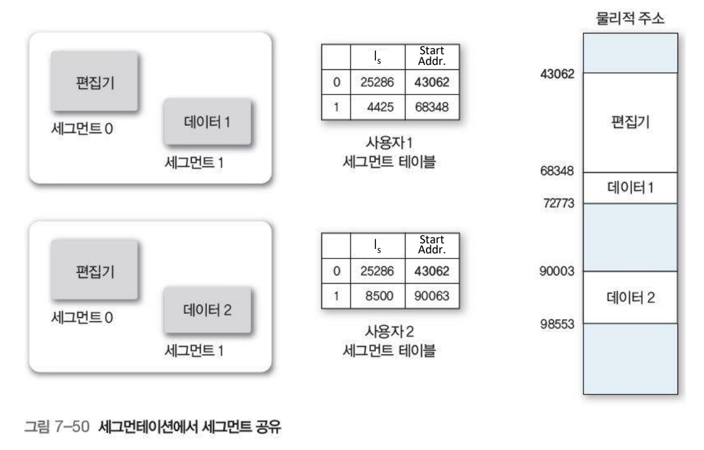

Created by : seophohoho  
Created time : 2023-11-19 22:44  
Tags : #CS #OS 
## What is Segmentation-System?
- 프로그램을 논리적 block으로 분할(segment)
- block의 크기가 서로 다를 수 있음
- ex) stack, heap, main procedure, shared lib, Etc...
- page-system과는 다르게 메모리를 미리 분할 하지 않음
- Segment sharing/protection이 용이
	- Address mapping 및 메모리 관리의 overhead가 큼
	- No internal fragmentation
		- But, External fragmentation 발생

  
## AddressMapping
- Virtual Address는 v = (s,d)
	- s = segment number
	- d = displacement in a segment(=offset)
- Segment Map Table(SMT)을 사용
	- segment length =  각 segment의 길이
	- protection bits = 각 segment에 대한 접근 권한

- Address mapping Mechanism
	- Direct mapping
### AddressMapping/Mechanism/DirectMapping

1. process의 SMT가 저장되어 있는 시작 주소 b에 접근
2. SMT에서 segment s의 entry 찾음(s의 entry 위치 = b + s x entrysize)
3. 찾아진 entry에 대해서 다음 단계들을 순차적으로 실행
	1. if residence bit = 0, (segment fault 발생)swap device로부터 해당 segment를 메모리로 적재 후 SMT를 업데이트
	2. if offset d > segment length, segment overflow exception 호출
	3. if protection bits check(허가 되지 않은 연산일 경우), segment protection exception 호출
4. 실제 주소 r 계산(r = a + d)
5. r로 메모리에 접근
## Memory management
- VPM(Variable Partition Memory, 가변 분할 기억장치 할당) 기법과 유사
	- Segment 적재 시, 크기에 맞추어 분할 후 적재

## Segment Sharing/protection
- 논리적으로 분할되어 있기 때문에, 공유 및 보호가 용이

